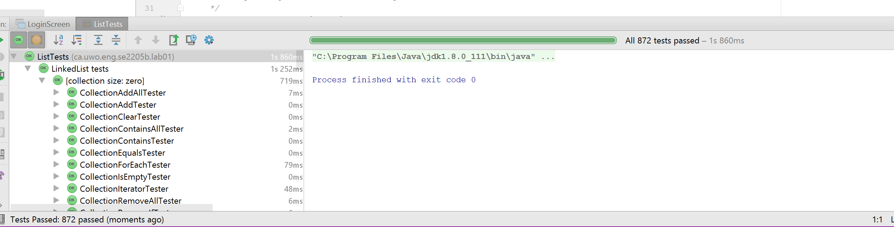
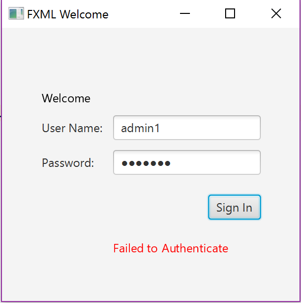
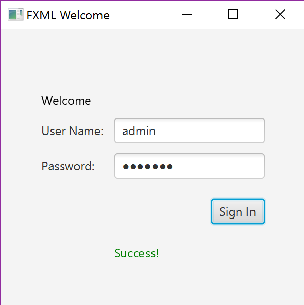

# Lab 01 - Lists and GUI Introduction

Figure 1: All jUnit tests passed

Figure 2: Login failed with wrong username

Figure 3: Login success

  ##Question 1 Answers
      
        1. In an ideal scenario, methods like addAll and removeAll could be overriden to improve the performance

        2. Linkedlist should most likely be faster, they are not the same speed because you just have to call getnext() and next()
       	while iterating, you dont have to worry about counters like an arraylist.

        3.In arraylist, add and remove require you to shift through functions(O(n)) while in linked list it is (O(1)) because you simple just create a new element
       In arraylist, get and set allow you to directly access the element (O(1)) while in linked list you must iterate to the required index (O(n))

        4.The benefits of testing is to make ABSOLUTELY sure that every possible scenario is successfull in your method. By testing all possibilities before
       	releasing the product, you save you and your company sooooo much time and money!

 ##Question 2 Answers
      
        1. FXML is used over raw code because it allows someone who doesnt particularly know code to create a user interface. It is also very useful
       	when you have complicated graphs or tables you are working with

       2. Using SceneBuilder you dont have to always code what you want and then recompile after every step to see the changes in your ui.
       	Also Scenebuilder has convienent access to buttons and textboxes, etc...and coding that by hand would be a nightmare

       3. The Callback interface is designed to allow for a common, reusable interface to exist for defining APIs that requires a call back in certain situations.
       	If it is reusable then i am assuming that is why JavaFX uses them.

See https://uwoece-se2205b-2017.github.io/labs/01-lists-gui-introduction
